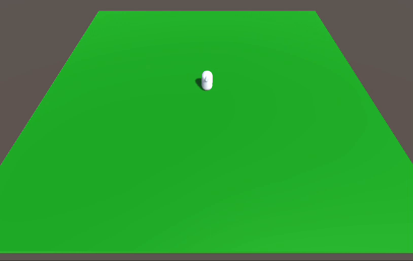

# Unity 基本角色移動範例 
 


此為教學範例，採用 CharacterController 和方向鍵控制角色移動。
 

<br/>

## PlayerController
```C#
using System.Collections;
using System.Collections.Generic;
using UnityEngine;

public class PlayerController : MonoBehaviour
{
    
    public float Speed;
    private CharacterController controller;

    void Start()
    {
        controller = GetComponent<CharacterController>();
    }

    void Update()
    {
        // 取得方向鍵輸入
        float h = Input.GetAxis("Horizontal");
        float v = Input.GetAxis("Vertical");

        // 合成方向向量
        Vector3 dir = new Vector3(h, 0, v);

        // 調整角色面對方向
        // 判斷方向向量長度是否大於 0.1（代表有輸入）
        if (dir.magnitude > 0.1f)
        {
            // 將方向向量轉為角度
            float faceAngle = Mathf.Atan2(h, v) * Mathf.Rad2Deg;

            // 使用 Lerp 漸漸轉向
            Quaternion targetRotation = Quaternion.Euler(0, faceAngle, 0);
            transform.rotation = Quaternion.Lerp(transform.rotation, targetRotation, 0.3f);
        }

        // 移動角色位置
        controller.Move(dir * Speed * Time.deltaTime);
    }
}

```